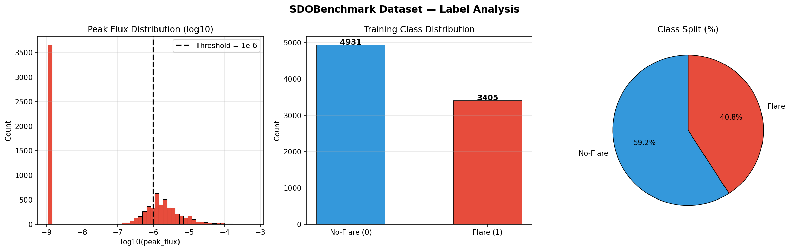
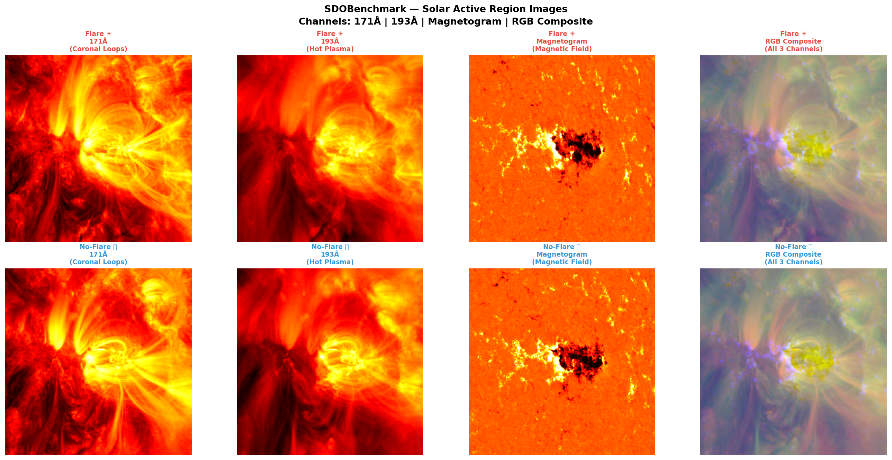
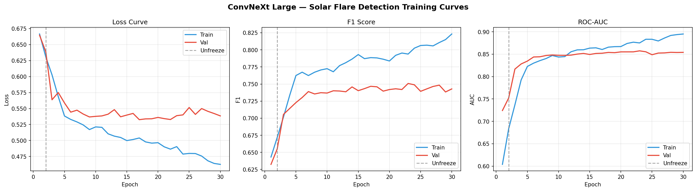
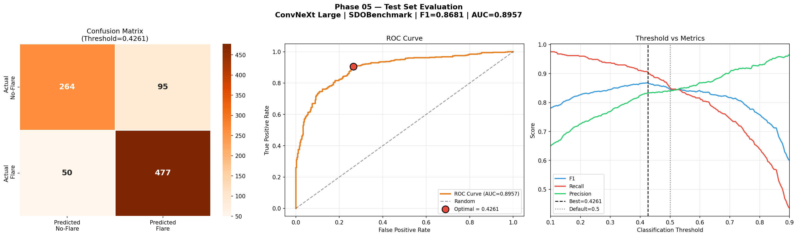
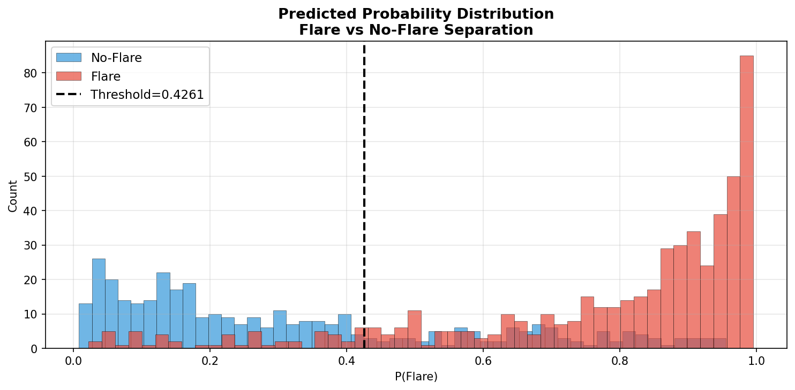
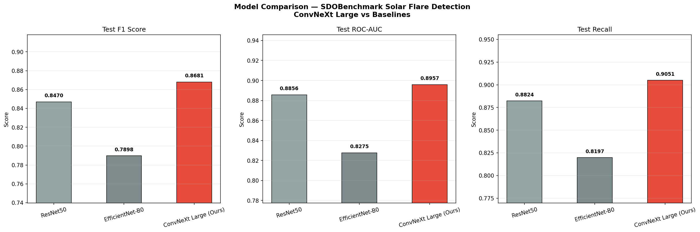
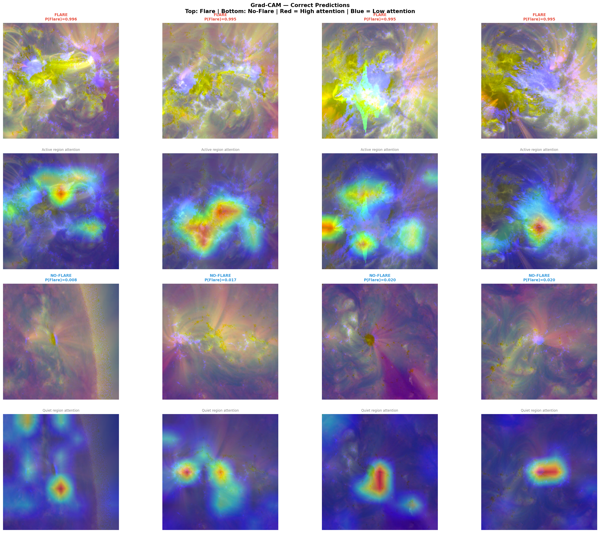
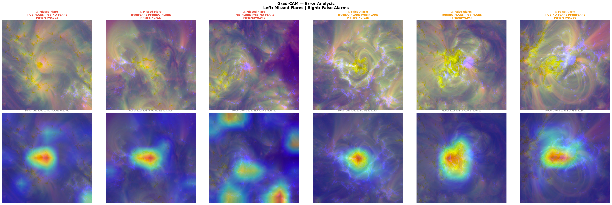

# ☀️ Solar Flare Detection from NASA SDO Imagery using Deep Learning

<p align="center">
  
  
  
  
  
</p>

<p align="center">
  <b>Automated solar flare detection from NASA Solar Dynamics Observatory (SDO) imagery using ConvNeXt Large and transfer learning.</b><br>
  Trained on SDOBenchmark | 86.81% F1 | 89.57% ROC-AUC | 90.51% Recall | Grad-CAM Explainability
</p>

---

## 📋 Table of Contents

- [Overview](#overview)
- [Dataset](#dataset)
- [Methodology](#methodology)
- [Model Architecture](#model-architecture)
- [Results](#results)
- [Baseline Comparison](#baseline-comparison)
- [Grad-CAM Explainability](#grad-cam-explainability)
- [Limitations](#limitations)
- [Project Structure](#project-structure)
- [How to Reproduce](#how-to-reproduce)
- [Tech Stack](#tech-stack)
- [Disclaimer](#disclaimer)

---

## 🔭 Overview

Solar flares are intense bursts of electromagnetic radiation from the Sun's surface. Strong flares (M and X class) can:
- Knock out satellite communications
- Disrupt GPS systems
- Damage power grid infrastructure
- Irradiate astronauts in space

Early and accurate prediction of solar flares is critical for space weather forecasting and protecting Earth's infrastructure.

This project builds an **AI-powered solar flare detection system** that classifies NASA SDO satellite images of solar active regions into:

| Class | Description |
|-------|-------------|
| **Flare** | Active region will produce a C-class or stronger flare (peak_flux ≥ 1×10⁻⁶ W/m²) |
| **No-Flare** | Active region remains below flare threshold |

The model achieves **90.51% Recall** on the official SDOBenchmark test set — meaning it correctly identifies 9 out of 10 flare-producing active regions.

---

## 📊 Dataset

**SDOBenchmark — Institute for Data Science, FHNW Switzerland**

The dataset contains multi-channel satellite imagery from NASA's Solar Dynamics Observatory (SDO), specifically from the Atmospheric Imaging Assembly (AIA) and Helioseismic Magnetic Imager (HMI) instruments.

| Property | Value |
|----------|-------|
| Total Samples | 9,222 |
| Training Samples | 8,336 |
| Test Samples | 886 |
| Image Channels | 10 per timestep (131Å, 171Å, 193Å, 211Å, 304Å, 335Å, 94Å, 1700Å, continuum, magnetogram) |
| Timesteps per Sample | 4 |
| Image Resolution | 256 × 256 pixels |
| Label | peak_flux (regression) → binary classification |

**Binary Label Threshold:**
- **Flare (1):** peak_flux ≥ 1×10⁻⁶ W/m² (C-class or above)
- **No-Flare (0):** peak_flux < 1×10⁻⁶ W/m²

**Data Split Strategy:**

| Split | Samples | Flare | No-Flare |
|-------|---------|-------|----------|
| Train | 6,633 | 2,667 | 3,966 |
| Validation | 1,703 | 738 | 965 |
| Test (Official) | 886 | 527 | 359 |

> **Critical:** Split was performed on Active Region (AR) number — not on individual samples. This prevents data leakage where the same active region appears in both train and test sets, which would artificially inflate performance metrics.

### Label Distribution



### Sample Images



---

## ⚙️ Methodology

### 1. Channel Selection
Each sample contains 10 imaging channels across 4 timesteps (40 images total). We selected the 3 most physically meaningful channels as RGB input:

| Channel | Wavelength | Physical Significance |
|---------|-----------|----------------------|
| **171Å** | EUV | Coronal loops at ~1MK — primary flare indicator |
| **193Å** | EUV | Hot plasma at ~1.5MK — flare precursor structures |
| **Magnetogram** | HMI | Photospheric magnetic field — root cause of flares |

These 3 channels are stacked to form a 3-channel RGB-like input compatible with ImageNet pretrained weights.

### 2. Temporal Strategy
Each sample has 4 timesteps. We use the **last timestep** — the observation closest to the flare prediction window — maximizing the information available before the event.

### 3. Class Imbalance Handling
Training data has a 1.49× imbalance (No-Flare vs Flare). Two complementary strategies:
- **WeightedRandomSampler** — oversamples Flare class during training
- **Class-weighted loss** — applies 1.24× higher penalty for missing Flare predictions

### 4. Gradual Unfreezing
- **Epochs 1–2:** Backbone frozen — only classification head trains
- **Epoch 3+:** Full model unfrozen with differential learning rates

### 5. Differential Learning Rates
- **Backbone:** 1×10⁻⁵ (preserve pretrained ImageNet features)
- **Head:** 1×10⁻⁴ (learn solar domain features faster)

### 6. Threshold Optimization
Default classification threshold (0.5) was replaced with an optimized threshold (0.4261) found using **Youden's J statistic** on the ROC curve. This improved F1 by +2.17% and Recall by +5.31%.

### 7. Advanced Augmentation
Domain-specific augmentations for solar imagery:

| Augmentation | Reason |
|-------------|--------|
| Random crop from 256→224 | Implicit translation invariance |
| Horizontal/Vertical flip | Solar disk is rotationally symmetric |
| ColorJitter | Handles instrumental calibration variations |
| Affine transforms | Geometric invariance across observation angles |
| GaussianBlur | Simulates different instrument resolutions |

---

## 🧠 Model Architecture

**ConvNeXt Large** — modernized CNN matching Vision Transformer accuracy with CNN efficiency.

| Property | Value |
|----------|-------|
| Architecture | ConvNeXt Large |
| Pretrained On | ImageNet-22k → ImageNet-1k |
| Total Parameters | 196.23M |
| Input Resolution | 224 × 224 |
| Input Channels | 3 (171Å, 193Å, Magnetogram) |
| Drop Path Rate | 0.2 (stochastic depth) |
| Output Classes | 2 (Flare / No-Flare) |
| Optimizer | AdamW |
| Scheduler | CosineAnnealingWarmRestarts (T₀=10) |
| Loss | CrossEntropyLoss + Label Smoothing (ε=0.1) + Class Weights |
| Mixed Precision | ✅ torch.amp |
| Gradient Clipping | max_norm=1.0 |
| Early Stopping | patience=7 on Val F1 |
| GPU | NVIDIA H100 80GB |
| Training Time | ~10.3 minutes |

---

## 📈 Results

### Training Curves



### Validation Performance

| Metric | Score |
|--------|-------|
| Best Val F1 | 75.08% |
| Val ROC-AUC | ~85.7% |
| Best Epoch | 23 |

### Official Test Set Performance (886 samples)

> Reported on the **official SDOBenchmark test set** — completely held out and never seen during training or validation.

| Metric | Default (0.5) | Optimal (0.4261) |
|--------|--------------|-----------------|
| **F1 Score** | 84.64% | **86.81%** |
| **ROC-AUC** | **89.57%** | **89.57%** |
| **Recall** | 85.20% | **90.51%** |
| Precision | 84.08% | 83.39% |
| Accuracy | 81.60% | 83.63% |

### Confusion Matrix (Official Test Set)

| | Predicted No-Flare | Predicted Flare |
|--|-------------------|----------------|
| **Actual No-Flare** | 264 ✅ | 95 ❌ |
| **Actual Flare** | **50** ❌ | 477 ✅ |

> Only **50 flares missed** out of 527 total. High recall is the clinical priority — missing a strong solar flare can have catastrophic consequences for satellites and infrastructure.

### Test Evaluation



### Probability Distribution



---

## 🏆 Baseline Comparison

All models trained on identical data, loss function, and augmentation pipeline. Only architecture differs.

| Model | Val F1 | Test F1 | Test AUC | Recall | Params | Epochs |
|-------|--------|---------|---------|--------|--------|--------|
| EfficientNet-B0 | 69.16% | 78.98% | 82.75% | 81.97% | ~5M | 15 |
| ResNet50 | 73.05% | 84.70% | 88.56% | 88.24% | ~25M | 15 |
| **ConvNeXt Large (Ours)** | **75.08%** | **86.81%** | **89.57%** | **90.51%** | ~196M | 30 |



> **Note:** Baselines trained for 15 epochs vs 30 for ConvNeXt Large. A fully converged comparison would likely narrow the F1 gap slightly, but the AUC and Recall advantages of ConvNeXt Large are consistent with its architectural superiority.

---

## 🔍 Grad-CAM Explainability

Gradient-weighted Class Activation Mapping (Grad-CAM) reveals which regions of the solar active region the model attends to when making predictions.

**Target Layer:** `stages[-1].blocks[-1]` — final convolutional block capturing highest-level semantic features.

### Correct Predictions



**Observations:**
- **Flare predictions:** Model attends to **complex coronal loop structures** and **high-gradient magnetic field regions** — exactly the physical precursors identified in heliophysics literature
- **No-Flare predictions:** Attention is **diffuse and scattered** — consistent with quieter, less energetically complex active regions

### Error Analysis



**Understanding failures:**
- **Missed flares (P(Flare)=0.02-0.04):** Attention maps resemble no-flare patterns — these active regions had unusually subdued morphology before erupting. Genuinely ambiguous cases
- **False alarms (P(Flare)=0.94-0.96):** Complex loop structures and strong magnetic gradients triggered high flare probability — physically reasonable even though no flare occurred in the prediction window

> *"Grad-CAM analysis confirms the model attends to physically meaningful regions — complex coronal loop structures and high-gradient magnetic field areas — consistent with established solar flare precursor indicators in heliophysics literature."*

---

## ⚠️ Limitations

1. **Single channel combination** — only 3 of 10 available channels used. Multi-channel fusion or temporal modeling across all 4 timesteps could improve performance.

2. **Binary classification only** — flares are classified as Flare/No-Flare. Multi-class classification (B/C/M/X intensity levels) is a harder and more clinically useful problem.

3. **Temporal information unused** — each sample has 4 timesteps but only the last is used. A CNN+LSTM or 3D ConvNet architecture exploiting temporal dynamics could capture flare buildup patterns.

4. **Prediction window fixed** — SDOBenchmark uses a fixed 24-hour prediction window. Real operational systems need multi-window forecasting (6h, 12h, 24h, 48h).

5. **Not an operational system** — this model is for research purposes only and has not been validated against real-time NOAA space weather forecasting standards.

---

## 📁 Project Structure
Solar-Flare-Detection-Using-Deep-Learning/
│
├── Solar_Flare_Detection_ConvNeXt_Large_SDOBenchmark.ipynb
├── requirements.txt
├── README.md
├── LICENSE
│
├── eda_labels.png
├── sample_images_fixed.png
├── training_curves.png
├── test_evaluation.png
├── probability_distribution.png
├── gradcam_correct.png
├── gradcam_errors.png
└── baseline_comparison.png

> Model weights (~800MB) stored on Google Drive due to GitHub size limits.

---

## 🚀 How to Reproduce

### Requirements
```bash
pip install torch torchvision timm albumentations torchmetrics
```

### Step 1 — Get the Dataset
Download **SDOBenchmark** from Kaggle: https://www.kaggle.com/datasets/fhnw-i4ds/sdobenchmark

Upload `SDOBenchmark_full.zip` to your Google Drive root.

### Step 2 — Open Notebook
Open `Solar_Flare_Detection_ConvNeXt_Large_SDOBenchmark.ipynb` in Google Colab.

### Step 3 — Select GPU
Runtime → Change runtime type → GPU → A100 or H100

### Step 4 — Run Phase by Phase

| Phase | Description |
|-------|-------------|
| Phase 01 | Environment setup & GPU verification |
| Phase 02 | Dataset extraction & label analysis |
| Phase 03 | Image pipeline & dataset class |
| Phase 04 | Model architecture & training |
| Phase 05 | Test set evaluation & threshold optimization |
| Phase 06 | Grad-CAM explainability |
| Phase 07 | Baseline comparison |

### Hardware Used
- GPU: NVIDIA H100 80GB HBM3
- Training time: ~10.3 minutes
- Also runs on A100/L4 (adjust BATCH_SIZE)

---

## 🛠️ Tech Stack

| Library | Version | Purpose |
|---------|---------|---------|
| Python | 3.12 | Core language |
| PyTorch | 2.10 | Deep learning framework |
| TIMM | 1.0.26 | ConvNeXt Large pretrained model |
| Albumentations | latest | Image augmentation |
| scikit-learn | latest | Metrics, class weights, ROC |
| Matplotlib / Seaborn | latest | Visualization |
| Google Colab | — | Training environment |
| Google Drive | — | Dataset and model storage |
| NumPy / Pandas | latest | Data processing |

---

## 📜 Disclaimer

This project is for **educational and research purposes only**.

It is **not** a validated operational space weather forecasting system. For real-time solar flare forecasting, refer to NOAA's Space Weather Prediction Center (https://www.swpc.noaa.gov/).

The SDOBenchmark dataset is publicly available via Kaggle for research use.

---

## 👤 Author

**Niteesh014**

[](https://github.com/Niteesh014)

---

## 📄 License

This project is licensed under the MIT License — see the [LICENSE](LICENSE) file for details.
